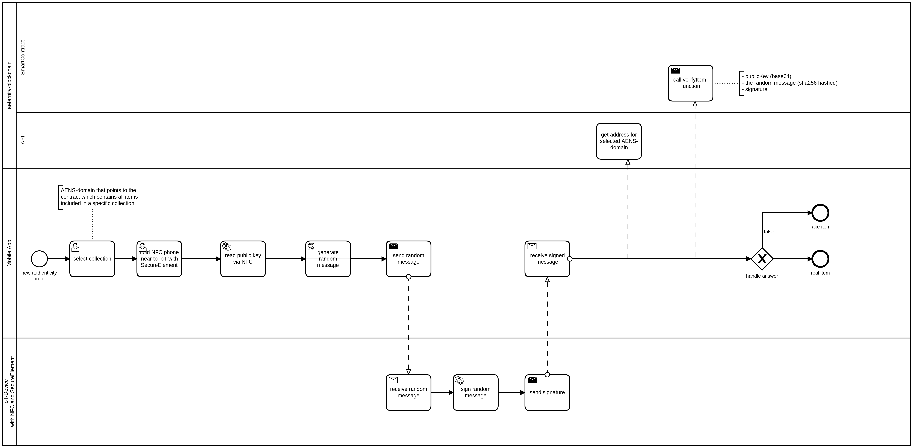

# Identity of Things

**The Problem**
- when you want to buy luxury items (e.g. a Rolex) you are not able to verify whether it is a fake or not
- when you receive items (e.g. medicine) in any company involved in a supply chain you can't be sure whether the package content is being compromised in between

**The solution**
- a miniscule tamperproof nfc-chip with a secure element (where private keys can't get compromised) is included in the item or package
- to verfiy the authenticity of an item the nfc-chip is being used to sign messages
- the public keys of selected items are stored in different smart contract registries which addresses can be resolved via AENS
- the registry smart contract (e.g. "Rolex 2019 limited") provides a function to verify the signed message and confirm the authenticity of a item

For demonstration purposes we will make use of a JavaCard (https://keycard.status.im/).

**The verification flow**

**Final presentation**
- [ItentityOfThings.pdf](IdentityOfThings.pdf)